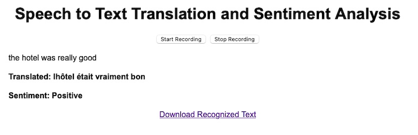

[](https://github.com/charliermarsh/ruff)
[](https://github.com/jvachier/Sentiment_Analysis/actions/workflows/test.yaml)
[](https://www.tensorflow.org/)
[](https://keras.io/)
[](https://www.tensorflow.org/)
[](https://www.python.org/)
[](https://github.com/astral-sh/uv)
[](https://opensource.org/licenses/Apache-2.0)

# Sentiment Analysis and Translation

This repository provides a comprehensive solution for real-time **speech-to-text**, **sentiment analysis**, and **English-to-French translation** using state-of-the-art machine learning techniques. It includes an interactive web application and robust pipelines for text processing, sentiment classification, and language translation.

---

## Overview



*Figure: High-level workflow of the application, including speech-to-text, sentiment analysis, and translation.*

---

## Key Highlights

**From-Scratch Implementation**: Complete Transformer architecture built from the ground up, demonstrating deep understanding of attention mechanisms, positional encodings, and encoder-decoder architectures.

**Production-Ready Pipeline**: End-to-end system integrating speech recognition, sentiment classification, and neural machine translation in a single application.

**Research-Grade Code**: Clean, well-documented implementation suitable for educational purposes and research experimentation.

**Hyperparameter Optimization**: Automated tuning with Optuna for both sentiment and translation models.

---
## Architecture

### Translation Transformer Model

The English-to-French translation system implements a **Transformer architecture built from scratch**. Rather than using pre-trained models or high-level APIs, this implementation provides full control over each component, from multi-head attention mechanisms to positional encodings.


*Figure: Detailed architecture of the Transformer model showing encoder-decoder structure with multi-head attention mechanisms.*

### Sentiment Analysis Model

The sentiment classifier uses a Bidirectional LSTM architecture:
- Embedding layer for word representations
- Bidirectional LSTM layers for capturing context from both directions
- Dense layers with dropout for classification
- Binary output (positive/negative sentiment)

---

## Features

### Speech Processing
- **Real-time Speech-to-Text**: Audio capture and transcription using Vosk library
- **English Language Support**: Optimized for US English accent (vosk-model-en-us-0.22)
- **Downloadable Transcripts**: Export recognized text as `.txt` files

### Sentiment Analysis
- **Bidirectional LSTM Architecture**: Deep learning model with embedding and recurrent layers
- **TensorFlow Text Processing**: Efficient tokenization and vectorization with `TextVectorization`
- **Binary Classification**: Positive/negative sentiment prediction
- **Hyperparameter Optimization**: Automated tuning with Optuna
- **Alternative Architectures**: Optional BERT-based models for comparison

### English-to-French Translation
- **From-Scratch Transformer Implementation**: Full encoder-decoder architecture built without pre-trained models
- **Custom Multi-Head Attention**: Manually implemented attention mechanisms with configurable heads
- **Positional Encoding**: Hand-crafted sinusoidal position embeddings
- **BLEU Score Evaluation**: Translation quality metrics for model assessment
- **Flexible Architecture**: Easily configurable dimensions, layers, and attention heads
- **Model Persistence**: Save and load trained models for inference
- **Real-time Integration**: Seamless connection with speech-to-text pipeline

### Interactive Web Application
- **Dash Framework**: Responsive web interface for real-time interaction
- **Live Processing**: Instant speech recognition, sentiment analysis, and translation
- **Visual Feedback**: Clear display of recognized text, sentiment, and translations
- **Export Functionality**: Download transcripts for offline use


---

## Note on Models

The sentiment analysis and translation models included in this repository are **toy models** designed for demonstration purposes. They may not achieve production-level accuracy and are intended for educational and exploratory use.

---

## Installation

### Prerequisites
- Python 3.11 or higher
- uv for fast dependency management (10-100x faster than pip/poetry)

### Install Dependencies
1. Install uv:
   ```bash
   pip install uv
   ```
   Or on macOS/Linux:
   ```bash
   curl -LsSf https://astral.sh/uv/install.sh | sh
   ```
2. Install project dependencies:
   ```bash
   uv sync
   ```

### Download the Vosk Model
1. Download the `vosk-model-en-us-0.22` model from the [official Vosk repository](https://alphacephei.com/vosk/models).
2. Extract the `.zip` file into the project directory:
   ```bash
   unzip vosk-model-en-us-0.22.zip -d vosk-model-en-us-0.22
   ```
3. Ensure the extracted folder is located in the root directory:
   ```
   Sentiment_Analysis/
   ├── vosk-model-en-us-0.22/
   └── ...
   ```

### Quick Start with Makefile
For easier development workflow, use the provided Makefile:

```bash
# Install all dependencies
make install

# Run tests
make test

# Check code quality
make lint

# Run the application
make run

# See all available commands
make help
```

---

## Required Datasets

### 1. Sentiment Analysis Dataset
- **Dataset**: [TripAdvisor Hotel Reviews Dataset (Kaggle)](https://www.kaggle.com/datasets/andrewmvd/trip-advisor-hotel-reviews)
- **Description**: This dataset consists of 20,000 reviews crawled from TripAdvisor, allowing you to explore what makes a great hotel and potentially use this model in your travels.
- **Setup**:
   - Download the dataset from the link above.
   - Place the dataset in the `src/data/` directory.

### 2. English-to-French Translation Dataset
- **Dataset**: [English-French Dataset (Kaggle)](https://www.kaggle.com/datasets/devicharith/language-translation-englishfrench)
- **Description**: This dataset contains English sentences paired with their French translations. It is used to train and evaluate the Transformer-based translation model.
- **Setup**:
  - Download the dataset from the link above.
  - Place the dataset in the `src/data/` directory as `en-fr.parquet`.

---

## Project Structure

```
Sentiment_Analysis/
├── app/                            # Application-specific files
│   ├── __init__.py                 # Makes the folder a Python package
│   └── voice_to_text_app.py        # Main application script
├── src/                            # Source folder
│   ├── data/                       # Dataset folder
│   ├── models/                     # Saved models
│   │   ├── inference_model.keras
│   │   ├── sentiment_keras_binary.keras
│   │   ├── transformer_best_model.keras
│   │   ├── optuna_model_binary.json               # Best binary classification model parameters from Optuna
│   │   └── optuna_transformer_best_params.json    # Best transformer model hyperparameters from Optuna
│   ├── configurations/             # Configuration files
│   │   ├── model_builder_config.json
│   │   ├── model_trainer_config.json
│   │   └── optuna_config.json
│   ├── modules/                                   # Custom Python modules
│   │   ├── __init__.py                            # Makes the folder a Python package
│   │   ├── data_processor.py                      # Data loading and preprocessing utilities
│   │   ├── transformer_components.py              # Transformer model components
│   │   ├── speech_to_text.py                      # Speech-to-text and sentiment analysis logic
│   │   ├── text_vectorizer_sentiment_analysis.py  # Text vectorization for sentiment analysis
│   │   ├── load_data.py                           # Data loading utilities
│   │   ├── model_bert_other.py                    # BERT-based sentiment analysis model
│   │   ├── sentiment_analysis_utils.py            # Utilities for sentiment analysis
│   │   ├── optuna_transformer.py                  # Optuna-based hyperparameter optimization
│   │   ├── utils.py                               # Utility functions and enums
│   │   ├── mem_reduction.py                       # Memory optimization utilities
│   │   ├── data_preprocess_nltk.py                # NLTK-based text preprocessing
│   │   └── text_vectorizer.py                     # Text vectorization utilities
│   ├── scripts/                                # Scripts for dataset management and preprocessing
│   │   ├── __init__.py                         # Marks the directory as a Python package
│   │   ├── loading_kaggle_dataset_utils.py     # Utilities for downloading and optimizing Kaggle datasets
│   │   ├── loading_kaggle_dataset_script.py    # Script to process Kaggle datasets
│   │   └── README.md                           # Documentation for the scripts folder
│   ├── translation_french_english.py       # English-to-French translation pipeline
│   ├── sentiment_analysis_bert_other.py    # Sentiment analysis using BERT
│   └── sentiment_analysis.py               # Sentiment analysis pipeline script
├── tests/                          # Unit and integration tests
│   ├── test_data_processor.py      # Tests for data_processor.py
│   └── test_model.py               # Tests for speech_to_text.py
├── .github/                        # GitHub-specific files
│   ├── workflows/                  # GitHub Actions workflows
│   │   └── test.yaml               # Workflow for running tests
│   ├── AUTHORS.md                  # List of authors
│   ├── CODEOWNERS                  # Code owners for the repository
│   ├── CONTRIBUTORS.md             # List of contributors
│   └── pull_request_template.md    # Pull request template
│
├── .gitignore                      # Git ignore file
├── LICENSE                         # License file
├── Makefile                        # Makefile for common tasks
├── pyproject.toml                  # uv configuration file
├── README.md                       # Project documentation
└── ruff.toml                       # Ruff configuration file
```

---

## Usage

### Interactive Application
1. **Run the Application**:
   ```bash
   uv run python app/voice_to_text_app.py
   ```
2. **Features**:
   - **Start Recording**: Begin recording your speech.
   - **Stop Recording**: Stop recording.
   - **Recognized Text**: Displays the text recognized from your speech.
   - **Translated Text**: Displays the English-to-French translation of the recognized text.
   - **Sentiment Analysis**: Displays the sentiment (positive or negative) of the recognized text.
   - **Download Recognized Text**: Provides a link to download the recognized text as a `.txt` file.

### Sentiment Analysis
1. **Train or Load the Model**:
   ```bash
   uv run python src/sentiment_analysis.py
   ```
   - If a saved model exists, it will be loaded.
   - Otherwise, a new model will be trained and saved in the `src/models/` folder.
2. **Evaluate the Model**:
   The script evaluates the model on the test dataset:
   ```
   Test Accuracy: 95.00%
   ```

### English-to-French Translation
1. **Prepare the Dataset**:
   Place your English-French dataset in the `src/data/` folder.
2. **Train or Load the Model**:
   ```bash
   uv run python src/translation_french_english.py
   ```
   - If a saved model exists, it will be loaded.
   - Otherwise, a new model will be trained and saved in the `src/models/` folder.
3. **Evaluate the Model**:
   The script evaluates the model on the test dataset and calculates the BLEU score:
   ```
   Test loss: 2.13, Test accuracy: 67.26%
   BLEU score on the test dataset: 0.52
   ```

---

## Customization

- Modify hyperparameters like `embed_dim`, `dense_dim`, and `num_heads` in `src/translation_french_english.py` for the Transformer model.
- Replace the dataset in `src/data/` with your own English-French dataset.

---

## License

This project is licensed under the Apache License 2.0. See the [LICENSE](LICENSE) file for details.

---

## Citation

If you use this project in your research or work, please cite:

```bibtex
@software{sentiment_translation_2025,
  author = {Vachier, Jeremy},
  title = {Sentiment Analysis and Translation},
  year = {2025},
  url = {https://github.com/jvachier/Sentiment_Analysis}
}
```
